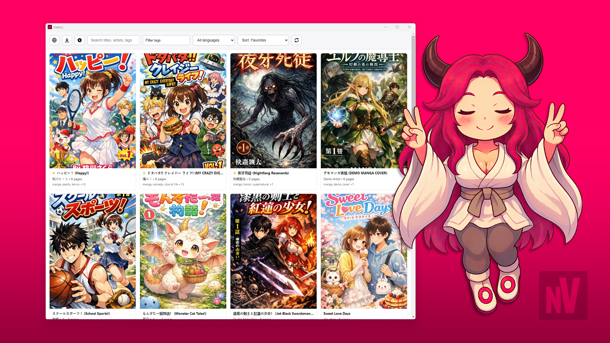

<p align="center">
  
</p>

# nView

**nView** is a Windows desktop app for collecting, organizing, and reading manga/hentai locally from **nHentai**.  
It combines a built-in Web Viewer, a direct download system, a gallery, and a reader into a single **privacy-first workflow**.

Your library is stored **locally**, **encrypted**, and under your control.  
Nothing is uploaded, synced, or shared.




| Feature | Description | Preview |
|-------|-------------|---------|
| Setup | First-launch screen where you create the passphrase that unlocks your encrypted local library. | [View screenshot](logo/screenshots/01_setup.png) |
| Settings | Configuration panel for Application URL, sorting defaults, display preferences, and viewer safeguards. | [View screenshot](logo/screenshots/02_settings.png) |
| Web Viewer | Minimal embedded browser for navigating supported pages and triggering direct downloads. | [View screenshot](logo/screenshots/03_browser_sfw.png) |
| Downloader | Progress view for active jobs, status updates, and error reporting while downloads run. | [View screenshot](logo/screenshots/04_downloader.png) |
| Gallery/Library | Main library grid with covers and metadata for your locally stored manga collection. | [View screenshot](logo/screenshots/05_gallery.png) |
| Reader | Focused reading mode with page navigation and fit controls for smooth local reading. | [View screenshot](logo/screenshots/06_reader.png) |
| Filters | Search and filter tools for narrowing the library by title, tags, language, and sort mode. | [View screenshot](logo/screenshots/07_filter.png) |
| Edit metadata | Editor dialog to update title, artist, language, tags, and other saved manga details. | [View screenshot](logo/screenshots/08_edit.png) |


---

## Table of contents

- [What nView is (and is not)](#what-nview-is-and-is-not)
- [Download & install](#download--install)
- [First launch (important)](#first-launch-important)
- [How nView works (the big picture)](#how-nview-works-the-big-picture)
- [Using nView](#using-nview)
  - [Gallery (library)](#gallery-library)
  - [Reader](#reader)
  - [Filters, search & sorting](#filters-search--sorting)
  - [Web Viewer](#web-viewer)
  - [Downloader window](#downloader-window)
  - [Direct download](#direct-download)
  - [Import manga](#import-manga)
  - [Export manga](#export-manga)
- [Settings](#settings)
  - [Security boundaries (allow list)](#security-boundaries-allow-list)
- [Privacy & security](#privacy--security)
- [Windows SmartScreen / Antivirus warnings](#windows-smartscreen--antivirus-warnings)
- [Developer docs](#developer-docs)
  - [Runtime architecture](#runtime-architecture)
  - [Core main-process modules](#core-main-process-modules)
  - [Secure local content delivery](#secure-local-content-delivery)
  - [Persistence layout](#persistence-layout-appgetpathuserdata)
  - [Download and indexing flow](#download-and-indexing-flow)
  - [Cryptography model (Vault)](#cryptography-model-vault)
  - [Test and quality gates](#test-and-quality-gates)
- [Build and run](#build-and-run)

---

## What nView is (and is not)

**nView is a desktop application — not a website.**

- The Web Viewer is a tool for browsing supported sites and triggering downloads
- Downloaded content is saved into your **local encrypted library**
- The HTML files in this repository are part of the app UI and are **not meant to be opened in a normal browser**

If you want something cloud-based or synchronized across devices, nView is intentionally not that.

---

## Download & install

### Recommended (easy):
Download the latest installer from GitHub Releases:

[](https://github.com/nview-app/nView/releases/latest/download/nView.Setup.2.6.0.exe)

Run the `.exe` and follow the installer. Please see: [Windows SmartScreen / Antivirus warnings](#windows-smartscreen--antivirus-warnings)


### Advanced:
Build and run from source (see [Build and run](#build-and-run)).

---

## First launch (important)

On first launch:

1. Install and run the application.
2. Set a **passphrase** used to unlock your encrypted local library.
3. After the passphrase is set, **Settings will open automatically**.
4. Enter the **Application URL** (nHentai website).
5. Save settings to continue.

⚠️ **If you forget the passphrase, your library cannot be recovered.**  
⚠️ The **Application URL** (nHentai website) is required for the Web Viewer and direct downloads to work.

---

## How nView works (the big picture)

Think of nView as four connected parts:

1. **Gallery** – your local library (covers, metadata, filters)  
2. **Reader** – read manga without distractions  
3. **Web Viewer** – browse supported sites and trigger downloads  
4. **Downloader** – tracks and manages active downloads  

Everything flows **into** the Gallery, and nothing leaves your machine.

---

## Using nView

### Gallery (library)

The Gallery is your permanent local library.

Each card represents a manga and supports:
- cover preview
- title, artist, tags
- favorites
- right-click actions

**Right-click menu (Gallery):**
- Add / Remove from favorites
- Edit metadata
- Delete (with confirmation)

The Gallery is incrementally updated to improve performance and memory use for large libraries.

---

### Reader

Click a manga card to open the **Reader**.

The Reader:
- lazy-loads pages
- streams decrypted image data in memory
- revokes page blobs when no longer needed
- keeps RAM usage stable even for large comics

**Reader controls:**
- **Space** – next page
- **F** – toggle fit mode
- Page dropdown – jump to any page
- Edit metadata directly from the Reader

Deleting a manga automatically closes the Reader first to prevent file-lock issues on Windows.

---

### Filters, search & sorting

In the Gallery you can:
- search by title, artist, tags, or ID
- filter by tags (match any / match all)
- filter by language
- sort by recency, title, page count, artist, or favorites

Tag and language options update dynamically based on your library.

---

### Web Viewer

Open it via **Open Web Viewer** from the Gallery toolbar.

The embedded browser is intentionally minimal:
- no persistent cookies
- no cache
- no saved sessions (everything resets when closed)

It is **not** a general-purpose browser. It exists to:
- browse the configured **Application URL** (nHentai website).
- extract metadata and image URLs
- trigger **Direct downloads**
- provide quick navigation via tags and bookmarks

---

### Direct download

Navigate to a supported gallery page in the Web Viewer.  
If a page supports direct download, nView shows a button in the UI.

When clicked:
- nView extracts the **full-size image URLs**
- downloads images directly
- encrypts them **on-the-fly**
- stores them in original format

At no point are plaintext images written to disk.

---

### Import manga

Use **Import manga** from the Gallery toolbar to bring an existing manga folder into your encrypted library.

The importer lets you:
- choose the source folder
- preview detected metadata before import
- confirm and add the manga to your local library

Imported files are processed into nView's local storage format, then become available in the Gallery and Reader like any other entry.

---

### Export manga

Use **Export manga** from the Gallery toolbar to create a portable export of items from your local library.

The exporter lets you:
- select one or more manga entries
- choose an output destination
- generate an export package for backup or transfer

After export finishes, nView keeps your in-app library unchanged while writing the exported data to the destination you selected.

---

### Downloader window

The **Downloader** window shows:
- active jobs
- progress
- completion status
- errors (if any)

When a job completes:
- temporary files are cleaned up
- memory is compacted
- the Gallery refreshes automatically

---

## Settings

Open **Settings** from the Gallery toolbar to configure application behavior, UI preferences, and security boundaries.

### Application URL (nHentai website)
Used as the Web Viewer homepage and for script hooks and download detection.  
This setting is required for browsing and direct downloads to work.

### Default sort
Controls how the Gallery is sorted when it opens.

### Manga card size
Controls the width of manga cards in the Gallery grid.

### Dark mode
Applies dark styling across the entire application.

### Block pop-up windows
Prevents websites in the Web Viewer from opening additional windows.

---

### Security boundaries (allow list)

#### Enable allow list
Restricts the Web Viewer to only load content from:
- the configured **Application URL**, and
- domains listed under **Allowed domains**.

All other domains are blocked.  
This acts as a lightweight content restriction, ad-blocking, and tracking prevention mechanism.

#### Allowed domains
Additional domains permitted to load in the Web Viewer.  
One domain per line. Wildcards are supported (for example: `*.cloudflare.com`).

Any domain not matching the Application URL or this list will be blocked when the allow list is enabled.

---

## Privacy & security

nView is built around **local-only, encrypted storage**.

**Key points:**
- No network sync
- No telemetry
- No background services
- No plaintext image files on disk

### Encryption
- **AES-256-GCM**
- Per-file keys derived via **HKDF**
- Master key protected using **scrypt**
- Files are encrypted as they are downloaded

Even during viewing, images are decrypted **in memory only** and streamed via a custom protocol.

---

## Windows SmartScreen / Antivirus warnings

This application is currently distributed as an unsigned Windows installer.  
Because the installer is not code-signed with a commercial certificate, Windows SmartScreen and some antivirus products may display a warning during download or installation (for example: “Windows protected your PC”).

This is a common limitation for independent and open-source projects and **does not indicate malicious behavior**.

To verify the integrity of the installer:
- Each release includes the SHA-256 checksum of the attached `.exe`
- A corresponding VirusTotal scan is linked in the release notes
- You can independently hash the downloaded file and compare it to the published checksum

Alternatively, you may **build the application yourself from source** using the instructions below.

If you are unsure, do not install the application.

Code signing may be added in a future release.

---

## Developer docs

### Runtime architecture

- **Electron main process (`main.js`)** orchestrates window lifecycle, IPC, download jobs, encrypted-library access, settings/bookmarks persistence, and secure local protocols.
- **UI renderer windows**:
  - `windows/index.html` + `renderer/renderer.js`: Gallery + Reader (library browsing, favorites, metadata editing, filter/search/sort, vault dialogs, settings).
  - `windows/browser.html` + `renderer/browser_renderer.js`: Web Viewer shell hosting a `BrowserView`, side panels (bookmarks/filter), and direct-download actions.
  - `windows/downloader.html` + `renderer/downloader_renderer.js`: Download queue monitor and controls (start/stop/cancel/remove, open result).
- **Preload bridges** (`preload/*.js`) expose a constrained API surface (`window.api`, `window.browserApi`, `window.dlApi`) instead of direct Node access in renderers.
- **Page-side helper injection** (`preload/browser_view_preload.js`) runs inside visited web pages to extract metadata/image URLs and trigger alternate/direct downloads.

### Core main-process modules

- `main/vault.js`: Vault initialization/unlock/lock and encryption primitives for files/streams.
- `main/vault_policy.js`: Passphrase policy checks and vault-mode migration rules.
- `main/direct_encryption.js`: Download-time encryption helpers, temporary encryption metadata, and migration helpers for temp assets.
- `main/download_manager.js`: Persistent direct-download job state machine (queuing, resume-after-restart, retries, finalization, cleanup).
- `main/library_index.js`: Maintains encrypted `.library_index.json`, normalizes metadata, and serves gallery/query helpers.
- `main/settings.js`: Reads/writes settings with encrypted-at-rest behavior when vault is enabled (with plaintext fallback compatibility).
- `main/bookmarks_store.js`: Encrypted bookmark storage and retrieval for the Web Viewer.
- `main/browser_payloads.js`: Validation/sanitization for renderer/browser payloads used by direct-download flows.
- `main/cleanup.js`: Deferred cleanup registries (`pending_cleanup.json`, `pending_file_cleanup.json`) and best-effort deletion utilities.
- `main/app_paths.js`: Centralized user-data path resolution for library/settings/bookmarks/cleanup artifacts.
- `main/utils.js`: Shared filesystem and helper utilities.

### Secure local content delivery

- `appfile://` serves already-decrypted thumbnail/image bytes from controlled paths.
- `appblob://` streams on-demand decrypted image data from encrypted library files.

Both protocols are registered as privileged Electron schemes and guarded by library-root path checks to prevent arbitrary filesystem reads.

### Persistence layout (`app.getPath("userData")`)
- Library/ # encrypted manga folders (comic_<timestamp>_<id>)
- Library/.vault.json # wrapped master key + KDF metadata
- Library/.library_index.json # encrypted gallery index/cache
- settings.json.enc # encrypted app settings when vault is active
- settings.json # compatibility plaintext settings (migration/fallback)
- bookmarks.enc # encrypted Web Viewer bookmarks
- pending_cleanup.json # deferred directory cleanup queue
- pending_file_cleanup.json # deferred file cleanup queue

Inside each comic folder, image pages remain in their original extension but are stored as encrypted blobs; metadata is stored as encrypted `metadata.json.enc`.

### Download and indexing flow

1. Browser-side extraction gathers full-size image URLs + parsed metadata.
2. `download_manager` creates a temp workspace/job, streams each file, and encrypts bytes before final persistence.
3. Final assets are moved into `Library/comic_*` and associated encryption metadata is finalized.
4. `library_index` writes/updates the normalized entry (title/artist/tags/pages/favorite/galleryId/path).
5. Main process emits IPC events (`dl:update`, `library:changed`, active count updates) to keep Gallery/Downloader state synchronized.
6. On app restart, unfinished jobs can be resumed and stale temp artifacts are swept via cleanup registries.

### Cryptography model (Vault)

- Vault mode is passphrase-gated and required for encrypted features.
- Passphrase -> KEK derivation uses **scrypt**.
- A randomly generated master key is wrapped with **AES-256-GCM**.
- Per-file keys are derived from the master key using **HKDF-SHA256** with relative file path context.
- File payloads use an authenticated encrypted format (`NVEN` header + version + nonce + tag + ciphertext).
- Direct downloads are encrypted during streaming, so successful download paths avoid plaintext-at-rest writes.

### Test and quality gates

- `npm run lint`: custom lint checks (`scripts/lint.js`).
- `npm run format:check`: formatting guard (`scripts/format-check.js`).
- `npm test`: Node test suite covering bookmark storage, payload sanitization/limits, library index, utils persistence/helpers, and vault policy.
- CI (`.github/workflows/ci.yml`) runs install + checks on pushes/pull requests.

---

## Build and run

### Requirements

- **Windows**
- **Node.js LTS** (recommended: 18+)
- **npm** (comes with Node)

### Install dependencies

```bash
npm install
```

### Run (development)

```bash
npm start
```

### Run automated checks (same as CI)

```bash
npm test
```

or run the aggregated check command:

```bash
npm run check
```

CI (GitHub Actions) runs `npm ci` and `npm run check` on every push and pull request.

### Build Windows executable

```bash
npx electron-builder --win
```

---
