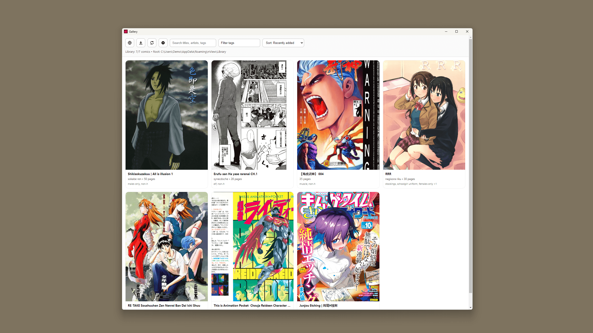

<p align="center">
  
</p>

# nView

nView is a Windows-focused Electron desktop app for collecting and reading comic/image-based downloads. It combines a built-in web viewer, direct download handling, a library gallery, and a reader into a single, **privacy-first workflow with on-the-fly encrypted storage**.

nView stores all data locally and does not sync, upload, or transmit library contents. Only explicitly downloaded content is persisted, and it is always stored in encrypted form.

[](https://github.com/nview-app/nView/releases/latest/download/nView.Setup.2.2.0.exe)



| Feature | Description | Preview |
|-------|-------------|---------|
| Gallery | Browse your local library with sorting, search and tags | [View screenshot](logo/screenshots/05_gallery_window.png) |
| Comic Reader | Clean, distraction-free reader with page navigation | [View screenshot](logo/screenshots/06_comic_viewer.png) |
| Web Viewer | Embedded browser with direct download support | [View screenshot](logo/screenshots/03_browser_window.png) |
| Downloader | Queue and track active downloads | [View screenshot](logo/screenshots/04_downloader_window.png) |
| Encrypted Storage | Library encrypted at rest with a required passphrase | [View screenshot](logo/screenshots/01_first_start_up.png) |
| Settings | Configure defaults, UI behavior and security options | [View screenshot](logo/screenshots/02_settings_modal.png) |
| Filters | Filter library using tags and metadata | [View screenshot](logo/screenshots/07_filter_modal.png) |

---

## Key functionality

- **Gallery library** with covers, metadata, and quick actions.
- **Reader** with page list navigation and in-app viewing.
- **Web Viewer** for browsing sites and triggering direct downloads with allow-list protection and bookmarks.
- **Ephemeral Web Viewer** with no persistent cache or session data; browser state is reset on close.
- **Direct download** (custom download method) pulling full-size images from thumbnails.
- **Downloader** window with progress and job controls for queued direct downloads.
- **Metadata editing** (title, artist, tags) and tag-based filtering.
- **Search + sorting** across title/artist/tags/ID and by recency, pages, or title.
- **Encrypted-by-default storage** with a required passphrase for all library files at rest.
- **On-the-fly encryption** so downloads are never written to disk in plaintext.
- **Original file formats** retained (no image conversion).
- **Settings** for application URL, allow list, popup blocking, and dark mode.

---

## User manual

### First launch
1. Install and run the application.
2. Set a passphrase to unlock your encrypted library.
3. **Gallery** window opens by default.
4. Open **settings** and set **Application URL**.
5. Use **Open Web Viewer** to browse and find content.

### Downloading content
#### Direct download (image galleries)
Some supported gallery pages expose a **Direct download** button in the Web Viewer.
1. Click **Direct download**.
2. nView pulls the full-size image URLs and downloads them directly.
3. Downloads are encrypted on-the-fly and stored in original formats.

### Reading and managing the library
- Click a comic card to open the **Reader**.
- Use the page dropdown to jump to a specific page.
- Use **Edit** to update title/artist/tags or delete a comic.
- Use **Filter tags** to narrow results (match any vs. match all).
- Use the **Search** box to find by title, artist, tags, or ID.
- Use **Sort** to change ordering (recent, title, pages, oldest).

### Comic viewer
- Toggle "Favorites" with star icon.
- Jump to a selected page.
- Edit title, author and tags.
- Press **f** to switch view mode.
- Press **space** to jump to the next page.

### Settings
Open **Settings** from the Gallery toolbar:
- **Application URL**: default URL for Web Viewer and script hooks.
- **Block pop-ups**: deny new windows from the Web Viewer.
- **Dark mode**: apply dark theme across the app.

---

## Technical description

### Architecture
- **Main process** (`main.js`) owns windows, the download manager, settings persistence, encrypted storage operations, and a custom `appfile://` protocol for safe local image loading.
- **Renderer UI** (`windows/index.html` + `renderer/renderer.js`) provides the Gallery, Reader, tag filtering, search, and settings UI.
- **Preloads** (`preload/preload.js`, `preload/browser_preload.js`, `preload/browser_view_preload.js`, `preload/downloader_preload.js`) expose controlled IPC APIs and add page metadata hooks for alternate downloads.
- **Image pipeline** (`main/image_pipeline.js`) moves images into a flat, page-numbered layout.

### Project file overview
- `main.js`: Electron main-process entry point; creates windows, wires IPC handlers, and coordinates core services.
- `main/`:
  - `app_paths.js`: Resolves and centralizes user-data/library filesystem paths.
  - `bookmarks_store.js`: Persists and retrieves browser bookmarks.
  - `browser_payloads.js`: Validates and normalizes Web Viewer payloads/messages.
  - `cleanup.js`: Handles startup/shutdown and temporary artifact cleanup.
  - `direct_encryption.js`: Streams download data through encryption before persistence.
  - `download_manager.js`: Manages direct-download queueing, progress, and lifecycle events.
  - `image_pipeline.js`: Imports/moves downloaded pages into flat, page-numbered comic folders.
  - `library_index.js`: Maintains and queries `.library_index.json` for gallery/search/filter data.
  - `settings.js`: Loads/saves application settings under `userData`.
  - `utils.js`: Shared utility helpers used across main-process modules.
  - `vault.js`: Core encryption, passphrase/key management, and file decrypt/encrypt helpers.
  - `vault_policy.js`: Enforces encryption/storage policy decisions and migrations.
- `preload/`:
  - `preload.js`: Main Gallery/Reader IPC bridge.
  - `browser_preload.js`: Web Viewer window IPC bridge.
  - `browser_view_preload.js`: Injected page-side helpers used by the Web Viewer.
  - `downloader_preload.js`: Downloader window IPC bridge.
- `renderer/`:
  - `renderer.js`: Main Gallery/Reader UI logic (library render, search/filter/sort, reader actions, settings interactions).
  - `browser_renderer.js`: Web Viewer renderer logic.
  - `downloader_renderer.js`: Downloader renderer logic and queue UI updates.
- `windows/`:
  - `index.html`: Main Gallery/Reader window markup.
  - `browser.html`: Web Viewer window markup.
  - `downloader.html`: Downloader window markup.
  - `shared.css`: Shared styles used by multiple renderer windows.
- `icon/`: SVG icon assets used by renderer windows.
- `logo/`: Branding assets and README screenshots.
- `favicon.ico`: Packaged application icon configured in Electron Builder.
- `scripts/`:
  - `format-check.js`: Enforces formatting checks used by `npm run check`.
  - `lint.js`: Lint runner used by `npm run check`.
- `test/`: Node test suite covering bookmarks, payload validation/limits, library indexing, utilities, and vault policy.
- `.github/workflows/ci.yml`: CI workflow running `npm ci` and `npm run check` on pushes and pull requests.
- `package.json`: Project metadata, npm scripts (`start`, `test`, `check`, `build:win`), and Electron build config.
- `package-lock.json`: Locked dependency tree for reproducible installs.
- `LICENSE`: Project license text.
- `README.md`: User/developer documentation.

### Data storage
All data is stored under `app.getPath("userData")` (per-user):

```
Library/           # final, viewable comics (encrypted)
settings.json      # app settings
.library_index.json
```

Each comic lives in its own folder (ex: `Library/comic_<timestamp>_<id>/`) containing encrypted pages and `metadata.json.enc`.

### Download pipeline
1. Direct download requests queue the full-size image list.
2. Images are encrypted on-the-fly during download (no plaintext writes).
3. Encrypted files are stored in a final `comic_*` folder (original formats).
4. Library index and metadata are updated.
5. The Gallery refreshes via IPC.

### Encrypted storage (Vault)
- Encrypted storage is mandatory and requires a passphrase.
- Uses **AES-256-GCM** with per-file keys derived via **HKDF** and a master key wrapped by **scrypt**.
- Existing library files are encrypted in place when upgrading.
- Downloads are encrypted immediately as data is written.

### Windows SmartScreen / Antivirus warnings
This application is currently distributed as an unsigned Windows installer.
Because the installer is not code-signed with a commercial certificate, Windows SmartScreen and some antivirus products may display a warning during download or installation (for example: “Windows protected your PC”).
This is a common limitation for independent and open-source projects and **does not indicate malicious behavior**.

To verify the integrity of the installer:
- Each release includes the SHA-256 checksum of the attached .exe
- A corresponding VirusTotal scan is linked in the release notes
- You can independently hash the downloaded file and compare it to the published checksum

Alternatively, you may **build the application yourself from source** using the instructions in this repository.

If you are unsure, do not install the application.

Code signing may be added in a future release.

---

## Build and run

### Requirements

- **Windows**
- **Node.js LTS** (recommended: 18+)
- **npm** (comes with Node)

### Install dependencies

```bash
npm install
```

### Run (development)

```bash
npm start
```

### Run automated checks (same as CI)

```bash
npm test
```

or run the aggregated check command:

```bash
npm run check
```

CI (GitHub Actions) runs `npm ci` and `npm run check` on every push and pull request.

### Build Windows executable

```bash
npx electron-builder --win
```

---
