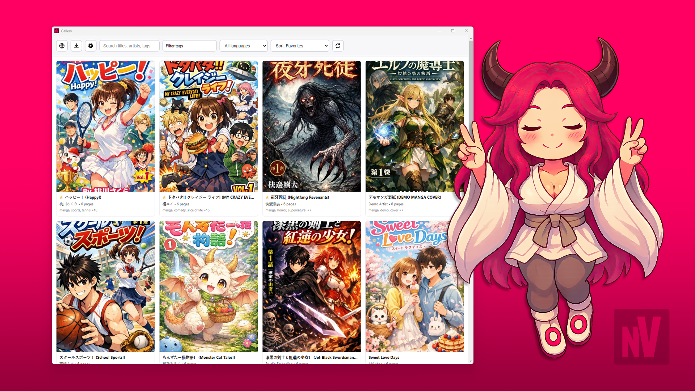

<p align="center">
  
</p>

# nView

**nView** is a Windows desktop app for collecting, organizing, and reading manga/hentai locally through modular **Source Adapters**.

Out of the box, nView includes Source Adapters for **nHentai**, **Doujins**, **E-Hentai**, **IMHentai** and **8muses**,.
It combines a focused Web Viewer, direct downloads, encrypted local storage, and a reader into one desktop workflow built for privacy and control.

Your library stays on your machine: local, encrypted, and under your control. Nothing is uploaded, synced, or shared.



---

## Download & install

### Recommended (installer)
Download the latest Windows installer from GitHub Releases:

[](https://github.com/nview-app/nView/releases/latest/download/nView.Setup.3.1.5.exe)

Run the `.exe` and follow the installer flow.
If Windows shows a warning, read [Windows SmartScreen / Antivirus warnings](#windows-smartscreen--antivirus-warnings).

### Advanced (build from source)
If you prefer full control over build outputs, use the instructions in [Developer docs, build & source adapters](#developer-docs-build--source-adapters).

---

## First launch

On first launch:

1. Start nView.
2. Create a passphrase used to unlock your encrypted local library.
3. Open **Settings** (opens automatically after setup).
4. Enter one or more **Source Adapter URLs**.
5. Save settings and continue to the Gallery.

⚠️ **If you forget the passphrase, the encrypted library cannot be recovered.**

For the complete walkthrough of daily usage (Gallery, Reader, Web Viewer, direct download, import/export, filters, and settings), read: **[User Guide](docs/user-guide.md)**

---

## Feature overview

| Feature | Description | Preview |
|-------|-------------|---------|
| Setup & local encryption boundary | First-launch setup establishes the passphrase boundary for your local library, with encrypted storage and secure key handling. | [View screenshot](logo/screenshots/01_setup.png) |
| Settings & adapter configuration | Configure Source Adapter URLs, defaults, display preferences, and Web Viewer safeguards. Includes built-in support for nHentai, Doujins, and E-Hentai. | [View screenshot](logo/screenshots/02_settings.png) |
| Web Viewer | Minimal embedded viewer for supported pages, URL matching, and direct-download initiation. | [View screenshot](logo/screenshots/03_browser_sfw.png) |
| Downloader window | Job queue and progress/status window for active downloads with completion/error visibility. | [View screenshot](logo/screenshots/04_downloader.png) |
| Gallery / library | Main local library grid with cover previews, metadata cards, favorites, and right-click actions. | [View screenshot](logo/screenshots/05_gallery.png) |
| Reader | Focused reading mode with page navigation, fit behavior, and memory-conscious rendering for large galleries. | [View screenshot](logo/screenshots/06_reader.png) |
| Search, filters, sorting | Search by title/artist/tags, filter by language/tags, and sort by recency/title/page count/artist/favorites. | [View screenshot](logo/screenshots/07_filter.png) |
| Metadata tools | Edit title, artist, language, tags, and other library metadata directly inside the app workflow. | [View screenshot](logo/screenshots/08_edit.png) |
| Import / export | Import local folders into encrypted library storage and export selected entries for backup/transfer workflows. | See [User Guide](docs/user-guide.md) |
| Source adapter architecture | Modular adapter system for per-site URL rules, metadata extraction, and page-list extraction. | See [Source Adapter Authoring Guide](docs/source-adapter-authoring-guide.md) |

---

## Major functionality

nView currently includes the following major capabilities:

1. Local encrypted library storage (AES-256-GCM with HKDF/scrypt-based key flow)
2. Gallery/library browsing for private local collections
3. Search + filter controls for tags/language plus configurable sorting
4. Scroll-based reader with fit/zoom behavior and page navigation helpers
5. Group management for organizing large manga libraries
6. Tag management workflows (create, rename, delete, apply)
7. Metadata editing for title, artist, language, tags, and related fields
8. Page-level editing tools (marking, page renaming/reordering where supported)
9. Embedded Web Viewer for supported source navigation
10. Source Adapter architecture for adding and maintaining source integrations
11. Direct-download pipeline with encryption during ingest
12. Import pipeline (local folders into encrypted app storage)
13. Export pipeline (selected entries to portable output)
14. Downloader job/status window for progress and error handling
15. Settings for adapter URLs, UI preferences, safeguards, and behavior defaults
16. Secure-memory/native addon support for sensitive runtime handling
17. Multi-window desktop workflow (reader, downloader, import/export helpers)
18. Navigation/history helpers for compatible Web Viewer flows
19. Thumbnail/image processing pipeline tuned for memory stability
20. Developer/operations tooling for checks, packaging validation, and adapter authoring

For the full detailed inventory, see **[docs/major-functionality.md](docs/major-functionality.md)**.

---

## Windows SmartScreen / Antivirus warnings

nView is currently distributed as an unsigned Windows installer.
Because the installer is not code-signed with a commercial certificate, Windows SmartScreen and some antivirus products may show warnings during download or installation (for example: “Windows protected your PC”).

This warning behavior is common for independent/open-source desktop releases and does **not** automatically indicate malicious behavior.

To verify installer integrity:

- Check the published SHA-256 checksum in the release
- Review the linked VirusTotal scan from the release notes
- Hash the downloaded file yourself and compare with the published checksum

If you are unsure, do not install and instead build from source using the documentation below.

---

## Privacy & security

nView is designed around local-first, encrypted storage.

**Core privacy principles:**
- No telemetry
- No cloud sync
- No background upload service
- Library data is intended to remain local to your machine

**Security model highlights:**
- AES-256-GCM encrypted storage
- Per-file key derivation via HKDF
- scrypt-protected master key material
- Encryption during download/import handling
- In-memory pipeline for decrypted page data while reading

In practice, nView is built so your manga/hentai library remains private and locally controlled.

---

## Developer docs, build & source adapters

If you are building, extending, or auditing nView, start here:

- **[Build and run guide](docs/build-and-run.md)**
- **[Developer Code Map](docs/developer-code-map.md)**
- **[Source Adapter Authoring Guide](docs/source-adapter-authoring-guide.md)**

### Quick local run

```bash
npm install
npm run check:native
npm start
```

nView includes a native addon (`.node`) for secure-memory operations, so native build tooling is required on development machines.
